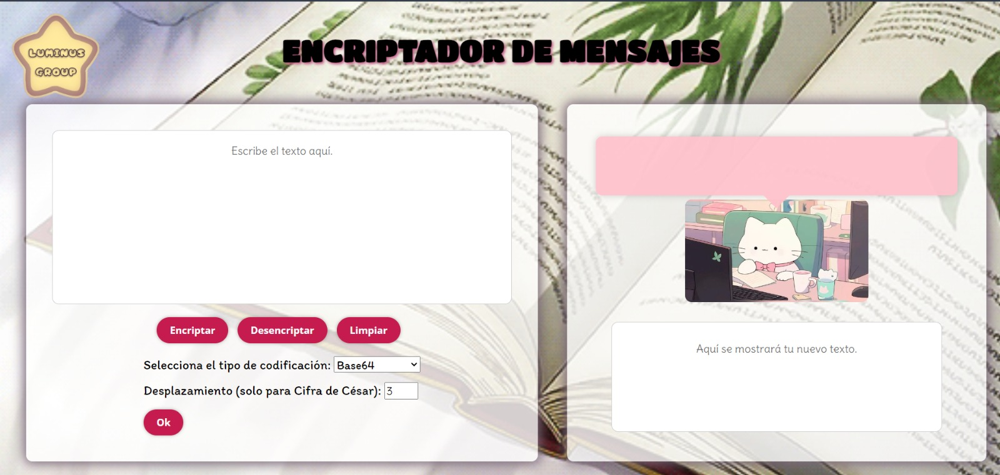
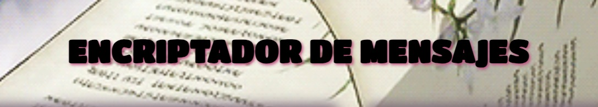
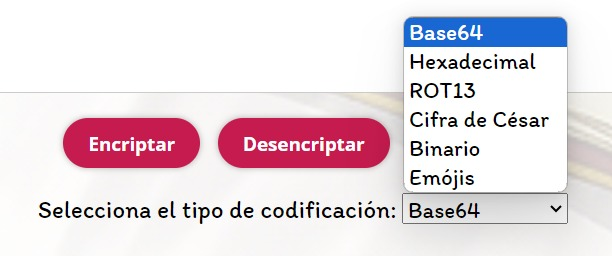
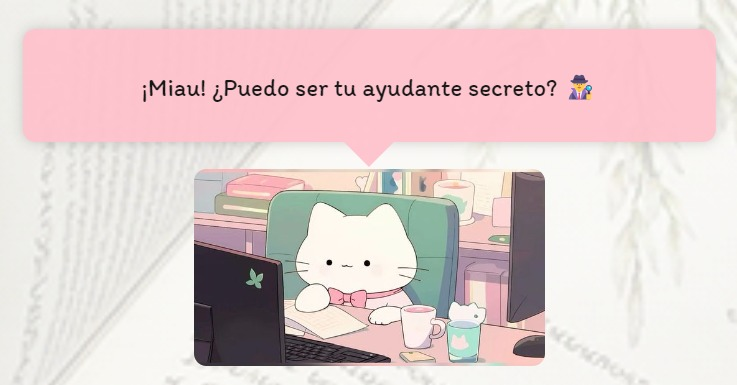

# Encriptador de mensajes 

---

## Identificación de la problemática

>Hay situaciones en la vida cotidiana en la que tenemos necesidad de enviar mensajes sin que nadie se enteré lo que escribimos y solo se requiere que a la persona que le enviamos lo sepa. 

Con los mensajes ocultos e imposibles de leer a simple vista es la solución al caso; se puede enviar textos a amigos y pareja de forma segura sin la necesidad que una persona externa lo lea o entienda.

## Objetivos del proyecto 

Con **el encriptador de mensajes**, se puede enviar información a cualquier persona sin que nadie más que las personas que comparte está información se enteren, pues el objetivo de nuestra página web es que a muchos usuarios le encuentre útil e incluso les pueda parecer divertido y entretenido probarlo con **amigos, familiares y parejas**.

## Descripción de nuestro producto 

El encriptado de mensajes puede ser de mucha utilidad si se desea enviar un mensaje privado con uno a más usuarios, sin que sea legible entender a simple vista, solo la información será compartida con quien se deseé, ya sea familiares, amigos o pareja.

## Estructura y funcionalidades 

La estructura de la página web se compone de:

- **Título:** tema de la página.

- **Logo del equipo:** ubicado a la izquierda.

.png "Logo")

- **Dos secciones:** la primera es para encriptar y la segunda para desencriptar.

- **Botones:** están después de la caja para escribir. Estos tienen diferentes funcionalidades:

    - El primero es para encriptar
    
    - El segundo es para desencriptar
    
    - El tercero para limpiar la información. 

- **Listas desplegables:** la primera es para seleccionar el tipo de codificación, el segundo aparece cuando se preciona la optión de *"Cifra de César"*, para seleccionar el desplazamiento solo para el cifrado cesar.

- **Imágenes y diálogo:** La imagen es entretenida y la nube del dialogo aparecen frases que tienes en común dos palabras: *“gatos”* y *“programación”* cuando ponen el cursor sobre él.

## Guía para los usuarios

1. **Paso 1:** escribe el texto que se desea encriptar sobre la caja de texto ubicado en la sección izquierda. 

2. **Paso 2:** en la lista desplegable seleccione el tipo de codificación que se desee utilizar.

3. **Paso 3:** presione el botón de Encriptar para dar paso a la acción.

4. **Paso 4:** se le aparecerá la información ya encriptada sobre la caja de texto en la sección derecha.

5. **Paso 5:** Ahora puede copiar la información secreta para enviársela a un familiar, amigo o pareja. 

6. **Paso 6:** Envié el link de la página web al otro usuario para que entre y pueda desencriptar la información.

7. **Paso 7:** el otro usuario puede pegar el texto oculto en la caja a la derecha y presionar el botón de desencriptar para revelar la información.

8. **Paso 8:** ¡Listo! Ahora pueden compartir mensajes secretos sin la necesidad que personas externas se enteren.

